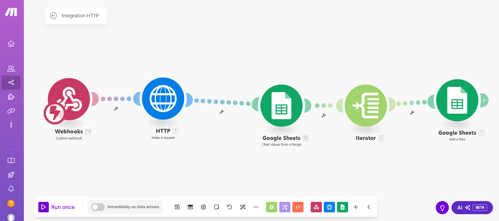
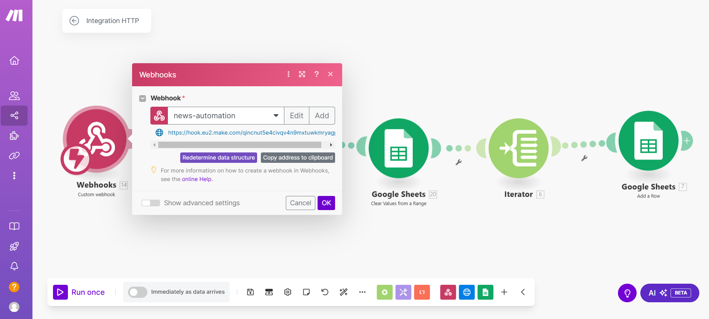
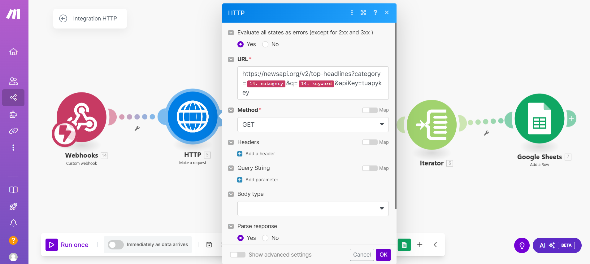
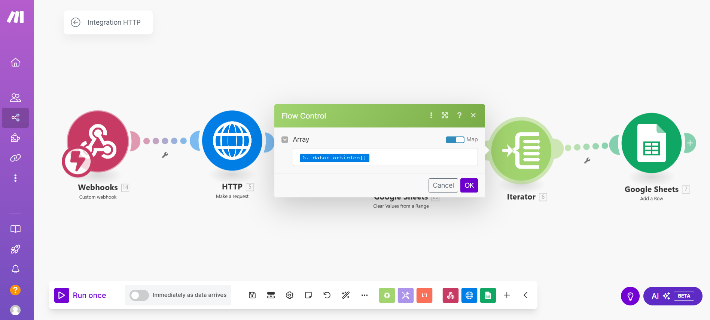
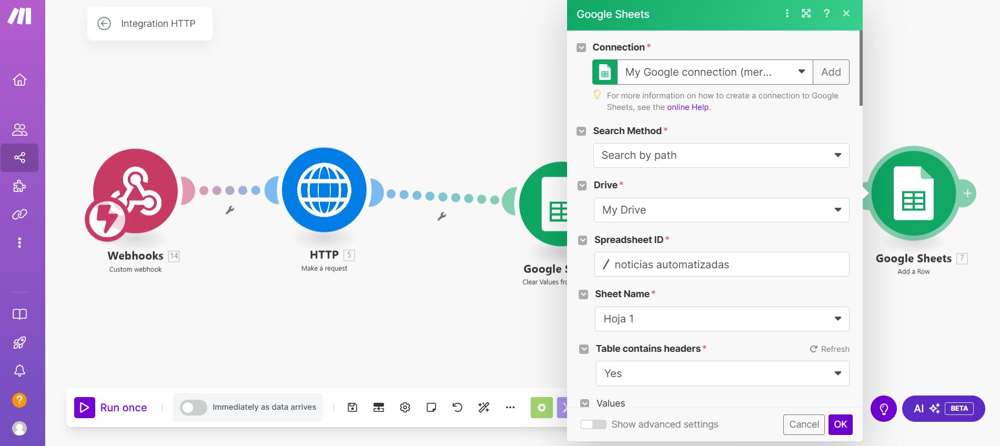

# Configuración del escenario de Make

Este proyecto utiliza **Make** para automatizar el flujo de datos entre el frontend, Google Sheets, y la API de noticias. A continuación, se describen los pasos para configurar el escenario.

## Escenario: Automatización de noticias

### Descripción
Este escenario se encarga de:
1. Recibir datos del frontend (categoría y palabra clave) mediante un webhook.
2. Obtener noticias desde una API externa basada en esos parámetros.
3. Guardar las noticias en Google Sheets.

### Módulos utilizados
1. **Webhook**:
   - **Tipo**: Custom webhook.
   - **URL**: Copia la URL proporcionada por Make e insértala en el archivo `.env` del proyecto como `VITE_WEBHOOK_URL`.

2. **HTTP** (Request):
   - **Método**: GET.
   - **URL**: `https://newsapi.org/v2/top-headlines`
   - **Parámetros**:
     - `keyword`: Pasado desde el frontend.
     - `category`: Pasado desde el frontend.
     - `apiKey`: Proporcionado por la API de noticias.

3. **Google Sheets** (Clear values):
   - Limpia la hoja antes de insertar nuevos datos.

4. **Iterator**:
   - Itera sobre las noticias obtenidas de la API.

5. **Google Sheets** (Add row):
   - Agrega cada noticia como una nueva fila en Google Sheets.

### Configuración del Webhook
1. Ve a [Make](https://www.make.com/).
2. Crea un nuevo escenario y añade un módulo de tipo "Webhook".
3. Copia la URL generada por Make y añádela al archivo `.env`:
VITE_WEBHOOK_URL=https://hook.eu2.make.com/tu-webhook


### Configuración del módulo HTTP
1. Añade un módulo HTTP al escenario.
2. Configura los siguientes parámetros:
- **Método**: GET.
- **URL**: `https://newsapi.org/v2/top-headlines`.
- **Query string**:
  - `keyword`: Mapear desde el webhook.
  - `category`: Mapear desde el webhook.
  - `apiKey`: Tu clave de la API de noticias.

### Configuración de Google Sheets
1. Conecta tu cuenta de Google Sheets a Make.
2. Añade un módulo "Clear values" para limpiar la hoja antes de insertar nuevos datos.
3. Configura un módulo "Add row" para añadir las noticias iteradas.

### Flujo completo del escenario
1. El frontend envía datos (categoría y palabra clave) al webhook.
2. Make utiliza el módulo HTTP para obtener noticias de la API.
3. Las noticias se procesan con el módulo Iterator.
4. Se guardan en Google Sheets.

### Capturas de pantalla
#### Flujo del escenario



#### Configuración del webhook


#### Configuración de HTTP


#### Configuración del Iterator



#### Configuración de Google Sheets


---


## Configuración de Sheety

### Descripción
Sheety se utiliza en este proyecto para:
1. Convertir una hoja de Google Sheets en una API REST.
2. Permitir que los datos de las noticias sean accesibles desde el frontend.

### Pasos para configurar Sheety
1. **Crear una hoja de Google Sheets**:
   - Crea una nueva hoja de cálculo en tu cuenta de Google Drive.
   - Nómbrala como quieras (por ejemplo, `noticias automatizadas`).
   - Asegúrate de que la primera fila de la hoja tenga los encabezados:
     - `título`
     - `descripción`
     - `url`

2. **Conectar la hoja a Sheety**:
   - Ve a [Sheety](https://sheety.co/).
   - Regístrate e inicia sesión.
   - Crea un nuevo proyecto en Sheety y conéctalo a tu hoja de Google Sheets.
   - Copia la URL API generada por Sheety.

3. **Configurar Sheety en el archivo `.env`**:
   - Añade la URL generada por Sheety en el archivo `.env` bajo la clave `VITE_SHEETY_URL`:
     ```env
     VITE_SHEETY_URL=https://api.sheety.co/tu_proyecto/nombreDeLaHoja
     ```

4. **Verificar la API de Sheety**:
   - Abre la URL de Sheety en tu navegador o usa Postman para asegurarte de que devuelve los datos esperados.

### Notas importantes
- Sheety necesita que compartas la hoja de Google Sheets como "Cualquiera con el enlace puede ver".
- La integración con Sheety simplifica el acceso a los datos, pero tiene limitaciones en términos de velocidad y volumen.


